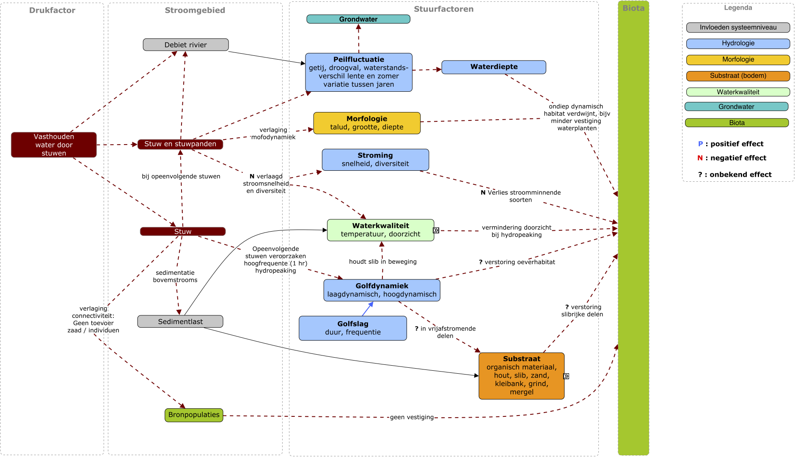

Introductie
============

Waarom een netwerk perspectief?
-------------------------------

Ecosystemen worden gevormd door relaties. De flora en fauna vinden in de fysieke omgeving mogelijkheden om zich te vestigen, maar
meteen daarna worden relaties met anderen soorten gelegd. Uiteinlijk ontstaat een complex geheel van samenhangende gemeenschappen.
In onderstaande TED-talk, wordt dit heel mooi weergegeven. Het is een reconstructie van welke soorten waar voorkomen in het Manhattan (VS)
van 1600, toen Manahatta genoemd. In de video presenteert Eric Sanderson eerst de reconstructie van de fysieke onderlaag, na 8 minuten
laat hij zien hoe de biologie onderling samenhangt en hoe zij dat hebben "gemodelleerd". 

.. raw:: html

    

<iframe src="https://embed.ted.com/talks/lang/nl/eric_sanderson_new_york_before_the_city" width="854" height="480" style="position:absolute;left:0;top:0;width:100%;height:100%" frameborder="0" scrolling="no" allowfullscreen>
    </iframe>

*Video: TEDtalk van Eric Sanderson, reconstructie van de natuur op Manahatta (New York in 1600).*

De context waarin wij dit willen toepassen is het beheer van gereguleerde rivieren. Riviersystemen in dicht bevolkte gebieden
zijn aangepast aan de wensen van menselijke gebruikers, voor de originele biologie zijn afwijkingen van het natuurlijk systeem
meestal drukken op het biologisch functioneren, de drukken (ingrepen) interfereren met de ecologische relaties.
Veranderingen in de intensiteit van drukken, zoals klimaat of scheepvaart, beïnvloeden het ecosysteem via veel ‘routes’. 
In de figuur hieronder een voorbeeld van de complexiteit van interacties tussen een drukfactor (in dit geval stuwen, links) 
en de biota (rechts).

De veranderingen in stuurfacturen veroorzaakt door de drukfactoren hebben op individuele soorten een verschillend effect. 
Maar wat niet in deze figuur staat, is dat soorten ook onderling van elkaar afhankelijk zijn voor schuilgelegenheid (waterplanten/vis), 
voortplanting (gastheer) of de een is voedsel voor de ander. Het samenspel van drukken heeft een complexe relatie met voorkomen van 
soorten en soorten onderling beïnvloeden elkaars voorkomen en voortplanting. Hierdoor kunnen door veranderingen van drukken 
effect-cascades ontstaan in de ecosystemen. Of, bij herstel van ecosystemen, hoeft het wegnemen van een enkele druk, niet tot 
een geheel herstel van het ecosysteem te leiden.  

**Gevolgen**

In het huidige beleid, inrichting en beheer van rivieren wordt die samenhang en onderlinge afhankelijkheid niet meegenomen in ‘operationele’ systeemkennis zoals:
- bij het inrichten van uiterwaarden of riviertakken;
- ecologische effect beoordeling van een functie-aanpassing (bijvoorbeeld meer/minder scheepvaart);
- (voorspellende) modellen voor scenario’s van drukken / inrichtingsalternatieven voor het onderbouwen van beleidskeuzen.

Met de huidige staat van modellen (in gebruik voor RWS) kunnen we nu voorspellen dat een soort kan overleven, en tegelijkertijd voorspellen dat het voedsel van
die soort niet overleeft. Het verband wordt niet gelegd, er wordt alleen naar de totale biodiversiteit gekeken.
Zonder de samenhang mee te nemen kunnen de huidige voorspellingen kunnen onbedoeld positief uitpakken voor ecologie en zo tot verkeerde 
besluiten leiden.

**iEAT verklaard**

iEAT is het acronym voor interactieve Ecologische Analyste Tool (interactive Ecological Anaysis Tool)
\
