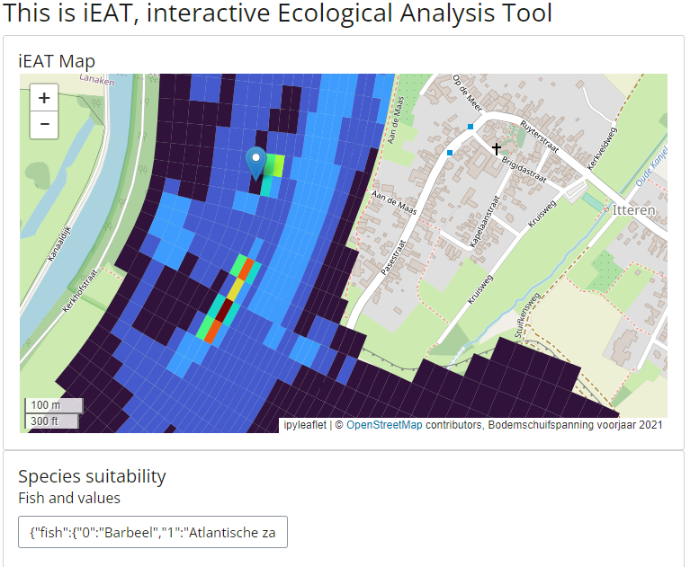

Eerste praktische implementatie
===============================

De applicatie
-----------------

Als praktische implementatie voor de Boven-Maas wordt een interactieve applicatie voorgesteld waarbij 
een gebruiker, via keuzes, de waarde van een aantal drukfactoren kan wijzigen en instantaan het effect op soorten kan visualiseren. Het idee is de ecologische relaties 
tussen soorten en omgevingsvariabelen in een GraphQL DDL (data definitie laag, ofwel het geheel van tabellen en de relaties tussen tabellen) worden ondergebracht. 
De drukfactoren bestaan uit ruimtelijke gegevens die uit baseline applicaties opgehaald kunnen worden voor de Boven-Maas.

Een mockup van de applicatie is als animatie opgenomen, zie daarvoor 

`Bekijk de video <https://github.com/openearth/iEAT/assets/6429095/d1ed9c22-c4c6-487e-8944-cb77249ee5aa>`

Data gebruik
-----------------
Als voorbeeld van een drukfactor is de stroomsnelheid gebruikt. De gegevens, zijn afkomstig van een scenario berekening met RWS BaseLine voor project
Basis Rivier Bodemligging. 
Afhankelijk van de gebruikte drukfactoren en scenario's worden diverse datasets voorzien. 

Data architectuur
-----------------
Als architectuur voor de data wordt voorgesteld gebruik te maken van data services volgens de OGC standaarden. Het voordeel is dat gemakkelijk nieuwe dataset beschikbaar gemaakt
kunnen worden vanuit modellen. Het gebruik van OGC standaarden brengt flexibiliteit met zich mee. Als de data geschikt is kunnen deze datalagen ook van andere instanties dan directive
die van Deltares gebruikt worden. Het biedt vele andere mogelijkheden voor flexibel gebruik. Door FAIR volledige toe te passen is het zelfs mogelijk om dele van de applicatie zodanig
in te richten dat de scenario's opgehaald worden uit de metadata van de lagen. OGC services zijn hier een bewuste keuze, die zorgen voor beschikbaarheid, interactie en uitgebreide mogelijkheden 
wat betreft visualisatie van data.

Wat betreft de operationalisatie van een netwerk van ecologische relaties wordt een geografische database gebruikt. In Libaries en database wordt hier verder op ingegaan, inclusief
de gebruikte packages.

Een prototype
-----------------
Een prototype in een Python Shiny applicatie maakt het mogelijk om de cursor te verschuiven over de uitkomsten die als OGC WFS worden
aangeboden. De waarde van de cursor wordt uit de data opgehaald. Vervolgens wordt een opzoektabel geraadpleegd waarin per soort een range van stroomsnelheden is opgenomen. Als 
de stroomsnelheid binnen de range valt, dan kan een soort daar voorkomen (als hypotethisch geval).
Hieronder een impressie van dat prototype.

Libraries en database
-----------------
Als database wordt een geografische database gebruikt. De voorkeur gaat daarbij uit naar PostgreSQL/PostGIS. Deze open source database geeft alle mogelijkheden
om een GraphQL DDL op te nemen en heeft tevens ruimtelijke functionaliteit beschikbaar.
Naast Python worden de volgende packages gebruikt:

- graphql-python-api
- ariadne 
- flask 
- flask-sqlalchemy 
- flask-cors
- psycopg2-binary
